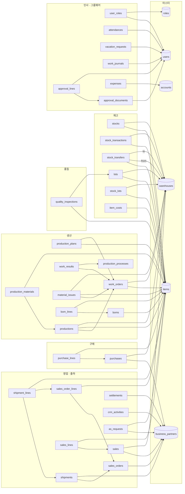

# DB 관계 모델 — 현황 진단과 설계안

작성: 2026-07-10 / 대상 DB: `erp-postgres` (PostgreSQL 16.14), 스키마 `public`
이 문서는 **설계 문서**입니다. 코드는 변경하지 않았습니다.

---

## 0. 먼저: "관계형 DB가 안 만들어졌다"는 사실이 아니다

실제 DB를 직접 조회해 확인한 결과입니다.

| 항목 | 실제 값 |
|---|---|
| 테이블 | 56 |
| 컬럼 | 540 |
| FK 제약 | **60 (전부 DB 레벨에서 강제됨)** |
| UNIQUE 제약 | 31 |
| CHECK 제약 | 40 |
| JPA 엔티티 / enum | 55 / 20 |
| 프론트 페이지 중 실제 API 호출 | 99 / 119 |
| 하드코딩 목데이터 배열 | 0 |

FK는 장식이 아니라 실제로 동작합니다. 검증:

```
insert into sales_orders(..., partner_id) values (..., 99999);
→ ERROR: violates foreign key constraint ... Key (partner_id)=(99999) is not present in table "business_partners"

insert into items(..., category) values (..., 'NOT_A_CATEGORY');
→ ERROR: violates check constraint "items_category_check"
```

마스터 데이터도 있습니다: `items` 6, `business_partners` 5, `users` 4, `warehouses` 2, `boms` 1.

**따라서 필요한 작업은 "DB를 새로 만드는 것"이 아니라 "이미 있는 스키마를 고정하고, 끊긴 관계를 잇는 것"입니다.**

---

## 1. 현재 관계도 (실측 60개 FK)

`pg_constraint` 기준입니다. (`information_schema`는 FK를 일부 누락하므로 쓰지 마세요.)



핵심 흐름(수주 → 출하, BOM → 작업지시 → 실적, 재고 원장)은 **이미 관계로 이어져 있습니다.**

---

## 2. 진짜 문제 5가지

### 문제 1 — FK 60개 중 55개에 인덱스가 없다 ⚠️ 성능

Postgres는 FK 컬럼에 인덱스를 **자동 생성하지 않습니다.** 그래서:

- `items` 한 건 삭제 → 자식 테이블 20여 개 전부 순차 스캔
- `sales_order_lines`를 `sales_order_id`로 조회 → 풀스캔

인덱스가 이미 있는 5개: `attendances.user_id`, `boms.product_id`, `item_costs.item_id`, `stocks.item_id`, `user_roles.user_id` (전부 UNIQUE 제약의 부산물)

> **상태: 다른 세션이 `V2__index_foreign_keys.sql`로 처리 중.** 정확히 55개 인덱스를 만들며, 누락된 55개와 일치합니다. 건드리지 마세요.

---

### 문제 2 — 삭제 규칙이 전부 `NO ACTION` ⚠️ 설계 공백

60개 FK **전부** `ON DELETE NO ACTION`입니다. 삭제 정책이 설계된 적이 없다는 뜻입니다. 지금은 무엇을 지우든 런타임에서 예외가 터집니다.

의미별로 나뉘어야 합니다.

| 관계 유형 | 예시 | 권장 |
|---|---|---|
| **소유(부모 없이 자식 무의미)** | `sales_order_lines → sales_orders`<br>`shipment_lines → shipments`<br>`bom_lines → boms`<br>`purchase_lines → purchases`<br>`sales_lines → sales`<br>`production_materials → productions`<br>`approval_lines → approval_documents` | `ON DELETE CASCADE` |
| **마스터 참조(지우면 안 됨)** | `* → items`<br>`* → warehouses`<br>`* → business_partners`<br>`* → users` | `ON DELETE RESTRICT` + 마스터는 `active=false` 소프트 삭제 |
| **선택적 참조** | `shipments.sales_order_id`<br>`production_plans.work_order_id`<br>`quality_inspections.lot_id` | 컬럼 nullable 여부 먼저 확정 후 `SET NULL` 또는 `RESTRICT` |

`items`/`warehouses`/`business_partners`에는 이미 `active` 플래그가 있습니다. 하드 삭제를 금지하고 `RESTRICT`로 못박는 편이 안전합니다.

---

### 문제 3 — 사람 참조 22곳이 FK가 아니라 문자열

`users` 테이블이 있는데도 `varchar(50)` 이름으로 들고 있습니다. 이름이 바뀌면 끊기고, "이 사람이 만든 문서 전부" 같은 조회가 불가능하며, 오타를 DB가 막지 못합니다.

**감사 필드 `createdBy` — 15곳** (전부 `users.id` FK로 전환 대상)

```
AsRequest:60   Expense:53   Production:52   ProductionPlan:57   Project:56
Purchase:58    Sales:61     SalesOrder:63   ScheduleEvent:48    Settlement:51
Shipment:61    StockTransaction:59   StockTransfer:52   Survey:50   WorkOrder:62
```

**작성자/담당자 — 7곳**

| 위치 | 필드 | 실제 값 | 판단 |
|---|---|---|---|
| `BoardPost:36` | `author` | `admin`, `manager` | → `users.username` 과 일치. **FK 전환 가능** |
| `Notice:46` | `author` | (행 없음) | → `users` FK |
| `WorkPost:40` | `writer` | (행 없음) | → `users` FK |
| `ScheduleEvent:42` | `owner` | (행 없음) | → `users` FK |
| `Project:34` | `manager` | (행 없음) | → `users` FK (PM) |
| `WorkResult:41` | `worker` | 김철수, 박민수, 이영희, 정수진 | ⚠️ `users`(시스템 관리자·김부장·이사원)에 **없음.** 백필 불가 — 아래 참조 |
| `BusinessPartner:53` | `manager` | 김상무, 박대표, 이팀장, 정이사, 최과장 | ✅ **문자열 유지.** `users`에 없는 이름들 → 거래처 **측** 담당자(외부인)임이 데이터로 확인됨 |

**`WorkResult.worker` 결정 필요:** 작업자 4명이 `users`에 존재하지 않습니다. 세 가지 선택지가 있습니다.
1. 작업자를 `users`로 등록하고 FK 전환 (로그인 계정이 필요 없다면 과함)
2. 별도 `employees` 마스터를 만들고 그쪽으로 FK
3. 자유 입력 문자열로 유지 (현행)

생산 실적을 사람별로 집계할 계획이 있으면 2번이 맞습니다.

`BaseTimeEntity`에 `createdAt`/`updatedAt`이 이미 있으므로, `createdById`도 여기로 올려 Spring Data JPA Auditing(`@CreatedBy` + `AuditorAware`)으로 자동 주입하는 게 가장 깔끔합니다. 15곳을 개별 처리하지 않아도 됩니다.

---

### 문제 4 — 고립 테이블 16개

FK가 들어오지도 나가지도 않는 테이블입니다. 성격이 다르니 구분해야 합니다.

**(a) 정상 — 설정/싱글턴. 그대로 두면 됨 (9개)**

`company_info`, `preference`, `security_policy`, `management_items`, `price_order_settings`, `supply_items`, `production_resources`, `order_stages`, `order_types`

**(b) 끊김 — `users`에 연결되어야 함 (7개)**

`board_posts`, `notices`, `drive_documents`, `surveys`, `projects`, `schedule_events`, `work_posts`
→ 전부 문제 3의 문자열 참조가 원인입니다. 문제 3을 고치면 자동으로 해소됩니다.

**(c) `order_stages`, `order_types` — 연결 완료** ✅

> ⚠️ **정정.** 이 문서 초판은 두 테이블을 "시드만 돌고 읽는 코드가 없는 죽은 테이블"이라고 적었습니다. **틀렸습니다.** `grep ... | head -8`이 출력을 잘라 Controller·Service·프론트를 못 본 결과였습니다.

실제로는 완성된 기능입니다.

- `OrderStageController` / `OrderTypeController` — GET/POST/PUT/DELETE 전부 구현
- 프론트 `OrderStagePage.tsx` / `OrderTypePage.tsx` — 라우트 연결됨
- 이카운트 메뉴 등록: 영업 > 오더관리 > `오더관리유형리스트`, `오더관리진행단계`
- 데이터: 접수→견적→수주확정→생산→출하 / 일반수주·견적·샘플·긴급·정기납품

문제는 "죽었다"가 아니라 **"수주가 이 마스터를 참조하지 않는다"**였습니다. `V5`에서 연결했습니다.

```sql
ALTER TABLE sales_orders ADD COLUMN stage_id bigint;       -- → order_stages(id) RESTRICT
ALTER TABLE sales_orders ADD COLUMN order_type_id bigint;  -- → order_types(id)  RESTRICT
```

둘 다 nullable입니다 — 단계/유형 미지정 수주를 허용합니다.

---

### 문제 5 — 반쯤 이전하다 만 필드

`WorkResult`에 문자열과 FK가 **나란히** 있습니다.

```java
// WorkResult.java
private String process;                    // :32  ← 구식
@ManyToOne ProductionProcess processMaster; // :37  ← 신식 (work_results.process_id)
private String worker;                     // :41  ← users FK 여야 함
```

`process`를 지우고 `processMaster` 하나로 통일해야 합니다. 두 값이 어긋나면 어느 쪽이 진실인지 알 수 없습니다.

> ⚠️ `WorkResult.java`는 현재 다른 세션이 편집 중입니다.

---

## 3. 마이그레이션 설계

### 3.1 절대 하지 말 것

`ddl-auto: update`로 NOT NULL 컬럼을 추가하지 마세요. **데이터가 있는 테이블에서는 WARN만 남기고 조용히 실패합니다.** 이제 `ddl-auto: validate` + Flyway이므로 모든 스키마 변경은 `V*.sql`로만 합니다.

### 3.2 NOT NULL 컬럼 추가는 반드시 3단계

한 마이그레이션 안에서 순서대로:

```sql
-- 1) nullable 로 추가
ALTER TABLE sales_orders ADD COLUMN created_by_id bigint;

-- 2) 백필. 매핑 키는 users.username 이다 (데이터로 확인:
--    surveys.created_by='admin', board_posts.author IN ('admin','manager')
--    ↔ users.username IN ('admin','manager','staff'))
UPDATE sales_orders o
   SET created_by_id = u.id
  FROM users u
 WHERE u.username = o.created_by;

-- 3) 매핑 안 된 행 처리 후에만 NOT NULL + FK
--    (SELECT count(*) FROM sales_orders WHERE created_by_id IS NULL 로 먼저 확인)
ALTER TABLE sales_orders
  ALTER COLUMN created_by_id SET NOT NULL,
  ADD CONSTRAINT fk_sales_orders_created_by
      FOREIGN KEY (created_by_id) REFERENCES users(id) ON DELETE RESTRICT;

CREATE INDEX idx_sales_orders_created_by_id ON sales_orders(created_by_id);
```

**백필이 100% 매핑되지 않으면 `NOT NULL`을 걸지 마세요.** 현재 `users`는 4행뿐이고 문자열 `created_by` 값이 무엇인지 확인되지 않았습니다. 매핑 실패 행이 있으면 nullable로 남기거나 시스템 계정으로 채워야 합니다.

### 3.3 권장 순서

| 버전 | 내용 | 상태 |
|---|---|---|
| `V1` | baseline | ✅ 완료 (다른 세션) |
| `V2` | FK 인덱스 55개 | ✅ 완료 (다른 세션) |
| `V3` | `production_plans.work_order_no` 제거 | ✅ 완료 (다른 세션) |
| `V4` | **`employees` 마스터 신설 + 작업자 4명** | ✅ 완료 |
| `V5` | **`sales_orders` → `order_stages`/`order_types` FK** | ✅ 완료 |
| `V10` | `created_by_id` FK 전환 | ✅ 완료 (다른 세션) |
| — | 삭제 규칙: 소유 관계 7개 → `CASCADE` | ⬜ 미착수 (문제 2) |
| — | 삭제 규칙: 마스터 참조 → `RESTRICT` | ⬜ 미착수 |
| — | `work_results.worker` → `employees` FK | ⬜ 미착수 (아래 참조) |
| — | `work_results.process` 문자열 컬럼 제거 | ⬜ 미착수 (문제 5) |

**`work_results.worker` → `employees` FK 가 아직인 이유:** `WorkResult` 엔티티와 `ProductionActualInitializer`를 함께 고쳐야 하는데, 생산 영역은 다른 세션이 작업 중입니다. 또한 백필이 깨끗하지 않습니다 — `ProductionActualInitializer:57`이 `workOrderRepository.count() > 0` 이면 즉시 return 하므로 작업실적 시딩을 건너뛰고, 현재 `work_results.worker` 에는 `qa/qa.mjs` 가 넣은 `검증` 만 있습니다. `employees` 마스터는 준비됐으니 생산 영역이 정리되면 바로 이을 수 있습니다.

### 3.4 엔티티와 마이그레이션의 순서

`ddl-auto: validate`에서는 **마이그레이션이 먼저, 엔티티 필드가 그 다음**입니다. Spring Boot는 Flyway → Hibernate 순으로 실행하므로 한 커밋에 둘 다 넣으면 정상 기동합니다. 엔티티만 먼저 올리면 기동 실패합니다.

---

## 4. 지금 당장의 운영 리스크

### 4.0 🔴 2026-07-10 15:38 데이터 소실 발생 (기록)

Flyway 첫 실행 시 `erp` 스키마가 **비어 있어서 `V1`이 baseline 표시가 아니라 실제로 실행**됐습니다.

```
select version, description, type from flyway_schema_history;
 1 | baseline schema    | SQL    ← BASELINE 이 아니라 SQL. 즉 진짜 실행됨
 2 | index foreign keys | SQL
```

`baseline-on-migrate: true`는 **스키마가 비어있지 않을 때만** 보호해 줍니다. 이미 빈 상태였으므로 아무 보호도 하지 못했습니다.

소실 내역 (15:25 실측 → 15:40 실측):

| 테이블 | 이전 | 이후 | 비고 |
|---|---|---|---|
| `sales_orders` | 3 | **0** | 소실 (시더 없음) |
| `sales_order_lines` | 5 | **0** | 소실 |
| `shipments` | 3 | **0** | 소실 |
| `shipment_lines` | 4 | **0** | 소실 |
| `users` | 4 | 3 | 시더가 재생성한 3건만 |
| `warehouses` | 2 | 1 | 〃 |
| `attendances` | 10 | 9 | 〃 |

`DataInitializer` 계열이 마스터는 다시 채웠지만, **수주·출하 등 사람이 입력한 트랜잭션 데이터는 시더가 없어 복구되지 않았습니다.**

복구 불가: 백업 파일 없음, `archive_mode = off` (PITR 불가).

**재발 방지 — 스키마를 건드리는 작업 전에는 반드시:**

```bash
docker exec erp-postgres pg_dump -U erp -d erp --clean --if-exists > erp_backup_$(date +%Y%m%d_%H%M).sql
```

`V1`은 이제 `flyway_schema_history`에 체크섬이 박혔습니다. **`V1__baseline_schema.sql`을 수정하면 이후 모든 기동이 checksum mismatch로 실패합니다.** 수정하지 말고 `V3`부터 추가하세요.

### 4.1 `ddl-auto: validate` 로 인한 기동 실패

`ddl-auto: validate`가 켜졌습니다. **새 엔티티를 추가할 때마다 대응하는 마이그레이션 파일이 없으면 앱이 기동하지 않습니다.**

trade / settings / groupware / production·quality 네 갈래가 동시에 진행 중이므로 충돌이 잦을 것입니다. 급할 때 뚫을 탈출구:

```yaml
# application.yml
    hibernate:
      ddl-auto: ${DDL_AUTO:validate}
```

이렇게 두면 평소엔 `validate`, 막힐 때만 `DDL_AUTO=update`로 임시 우회할 수 있습니다.
(이 파일은 현재 다른 세션이 편집 중이라 반영하지 않았습니다.)

---

## 5. 작업 분담 — 충돌 방지

| 영역 | 소유 | 상태 |
|---|---|---|
| `pom.xml`, `application.yml` | 다른 세션 | 🔒 잠김 |
| `db/migration/V1`, `V2` | 다른 세션 | 🔒 잠김 |
| trade / settings / groupware / production·quality 엔티티 | 다른 세션 | 🔒 잠김 |
| `V3`~`V9` 설계 | 이 문서 | 📄 설계만, 미구현 |

### 미해결 질문

| # | 질문 | 상태 |
|---|---|---|
| 1 | `users`의 어느 컬럼이 `created_by` 문자열과 매칭되는가? | ✅ **`users.username`** (데이터로 확인) |
| 2 | `BusinessPartner.manager`는 우리 직원인가 거래처 담당자인가? | ✅ **거래처 측 담당자** → 문자열 유지 |
| 3 | `WorkResult.worker` 를 어떻게 할 것인가? | ✅ **`employees` 마스터 신설** (`V4`). FK 연결은 생산 영역 정리 후 |
| 4 | `order_stages` / `order_types`를 살릴 것인가, 지울 것인가? | ✅ **살려서 `sales_orders` 에 FK 연결** (`V5`) |
| 5 | 스키마 변경 전 백업을 자동화할 것인가? | ❓ 15:38·15:59 두 차례 소실 (§4.0) |

---

## 부록 — 재현용 조회

```sql
-- FK 전체 + 삭제규칙 + 인덱스 유무 (information_schema 말고 이걸 쓸 것)
SELECT c.conrelid::regclass AS src,
       c.confrelid::regclass AS dst,
       c.confdeltype AS del_rule,
       EXISTS (SELECT 1 FROM pg_index i
                WHERE i.indrelid = c.conrelid
                  AND (i.indkey::smallint[])[0:array_length(c.conkey,1)-1] = c.conkey) AS fk_indexed
  FROM pg_constraint c
 WHERE c.contype = 'f' AND c.connamespace = 'public'::regnamespace
 ORDER BY 1;

-- 고립 테이블
WITH fk AS (SELECT conrelid::regclass::text src, confrelid::regclass::text dst
              FROM pg_constraint
             WHERE contype='f' AND connamespace='public'::regnamespace)
SELECT tablename FROM pg_tables
 WHERE schemaname='public'
   AND tablename NOT IN (SELECT src FROM fk)
   AND tablename NOT IN (SELECT dst FROM fk);
```
