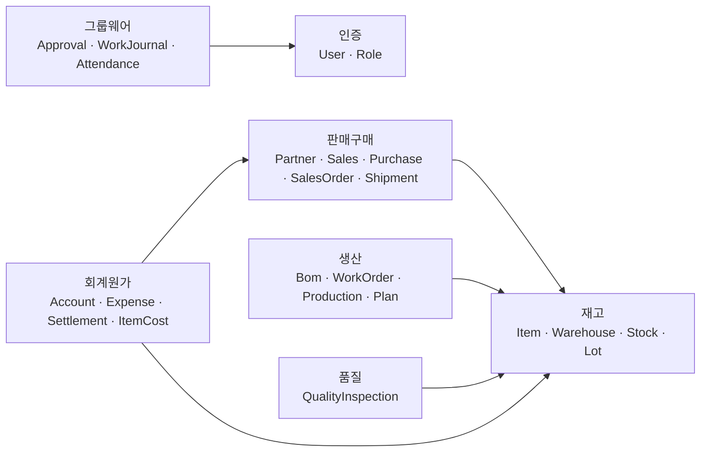
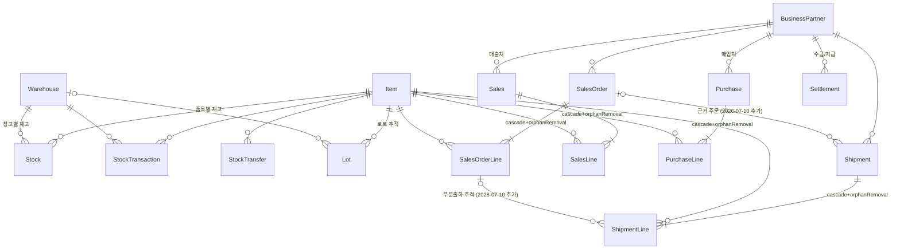
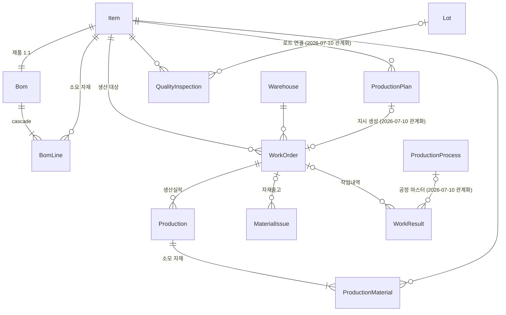
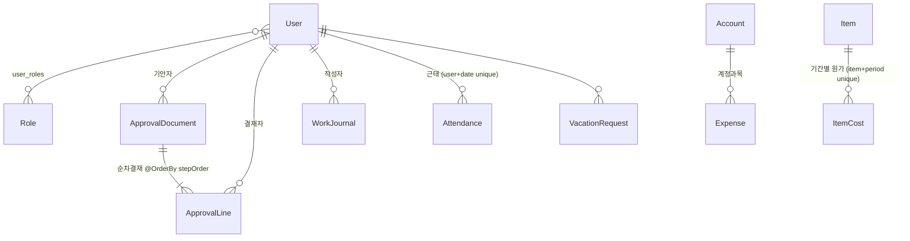
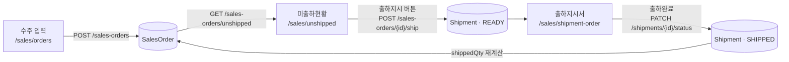
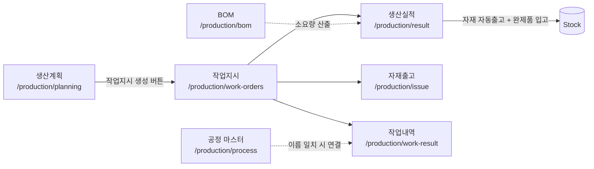
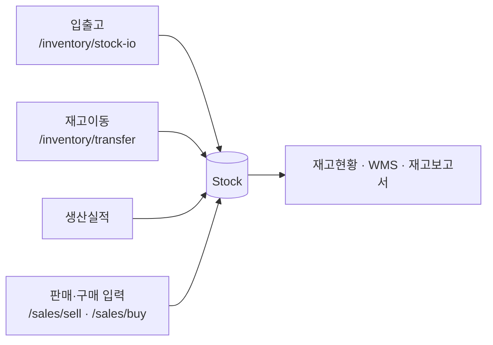
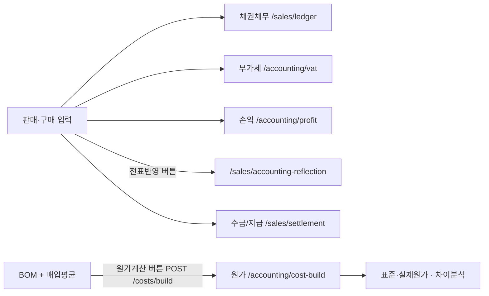

# 데이터 관계도 · 화면 흐름도

> 기준일 2026-07-10 · 백엔드 엔티티 74개 / 프론트 화면 100여 개를 실제 코드에서 추출해 작성했습니다.
> Mermaid 다이어그램은 GitHub, VS Code(Markdown Preview Mermaid), IntelliJ에서 그대로 렌더됩니다.

---

## 1. 한눈에 보는 모듈 구조



핵심: **재고(Item·Warehouse)가 모든 모듈이 참조하는 중심 마스터**입니다. 그룹웨어만 재고와 무관하게 인증에만 붙습니다.

---

## 2. 엔티티 관계 (ERD)

### 2.1 재고 · 판매/구매



> **수주 → 출하 관계는 2026-07-10에 새로 연결했습니다.** 그 전에는 `SalesOrderLine.shippedQty` 필드만
> 존재하고 아무도 증가시키지 않아, 미출하현황이 영원히 주문수량 전체를 표시했습니다.
> (정확히는 `shipped_qty` 컬럼 자체가 DB에 없어 `/api/sales-orders`가 500이었습니다. §6 참조)

### 2.2 생산 · 품질



### 2.3 그룹웨어 · 회계



---

## 3. 업무 흐름 — 데이터가 실제로 흐르는 경로

`화면연결` = UI에서 버튼으로 이어짐 · `DB파생` = 서버가 다시 계산해 별도 조회화면에서 봄

### 3.1 수주 → 출하 (2026-07-10 연결)



수량 규칙:

| 시점 | `SalesOrderLine.shippedQty` | 주문 상태 |
|---|---|---|
| 출하지시 생성 (READY) | 변화 없음. 단 **잔량을 선점**해 초과출하를 막음 | 접수 → 진행중 |
| 출하완료 (SHIPPED) | 출하수량만큼 증가 | 전량 도달 시 완료 |
| 출하취소 (CANCELED) | 되돌림 | 완료 → 진행중 |

`미출하잔량 = 주문수량 − 출하완료수량`. 초과출하는 `잔량=70.00, 요청=80` 형태로 거부됩니다.

### 3.2 생산



### 3.3 재고가 채워지는 네 갈래 (모두 DB파생)



### 3.4 회계/원가



---

## 4. 화면에서 저장하면 어디로 가는가

프론트에는 별도 API 서비스 계층이 없습니다. 모든 페이지가 `src/api/client.ts`의 axios 인스턴스 `api`를 직접 씁니다.
401이 오면 인터셉터가 `/login`으로 보냅니다. 에러 메시지는 `extractErrorMessage()`로 통일합니다.

**지배적인 저장 패턴** — 거의 모든 CRUD 화면이 동일합니다:

```ts
try { await api.post('/xxx', body); load() }   // 서버 저장 → 목록 재조회(REFETCH)
catch (err) { setError(extractErrorMessage(err)) }
```

| 저장 후 동작 | 해당 화면 |
|---|---|
| **NAVIGATE** (다른 화면으로 이동) | 로그인 → `/`, 기안서 작성 → `/groupware/approval/my`. **이 둘뿐입니다.** |
| **REFETCH** (제자리 재조회) | 나머지 모든 저장 화면 |
| **저장 없음** | (2026-07-10 해소) 환경설정·보안정책은 이제 `PUT /api/preferences`, `PUT /api/security-policy`로 영속됩니다 |
| **백엔드 미연동** | `settings/DownloadPage`, `settings/EtcSystemPage` — 실제 파일/외부 시스템이 없어 화면에 명시 |

주의할 점 두 가지:

- `MyPageDashboard`는 모든 조회 실패를 `.catch(() => {})`로 삼킵니다. 대시보드가 비어 보이면 에러가 숨겨진 것일 수 있습니다.
- `/sales`(판매입력)와 `/sales-orders`(수주)는 **서로 다른 엔티티**입니다. 수주가 자동으로 판매전표가 되지 않습니다. 수주는 출하로만 이어집니다.

### 목록화면 공통 동작

`EcListShell`이 본문에 렌더된 표를 직접 읽어 **Excel(.xlsx)·인쇄·검색·Option·도움말**을 자동 배선합니다.
페이지는 `actions={[{ label: 'Excel' }]}`처럼 라벨만 넘기면 됩니다. 화면에 적용된 필터가 그대로 내보내집니다.
자세한 규칙은 `src/utils/tableExport.ts` 주석 참조.

---

## 5. 아직 문자열로만 이어진 관계 (남은 부채)

| 위치 | 현재 | 영향 |
|---|---|---|
| 전 모듈 `createdBy` / `author` / `writer` / `inspector` / `worker` | `String` username | `users` 테이블과 FK 무결성 없음. 사용자를 삭제/개명해도 전표는 옛 이름을 붙들고 있음 |
| `Expense.partnerName`, `WorkJournal.partnerName` | 자유 텍스트 | 다른 모듈은 `BusinessPartner`를 참조하는데 여기만 문자열 |
| `VacationRequest.status` | `"대기"/"승인"/"반려"` 문자열 | enum이어야 함. 오타 방어 없음 |
| `ProductionResource.type`, `DriveDocument.drive`, `PriceOrderSetting.category` | 문자열 | enum 후보 |
| `LotStatus` enum | **선언만 되고 미사용** | `Lot`은 `boolean held`로 상태를 표현 중 |

`WorkResult.process`와 `QualityInspection.lotNo`는 문자열을 **의도적으로 남겨두고** FK를 함께 붙였습니다.
공정명·로트No는 자유입력을 허용해야 해서, 마스터에 일치하는 값이 있을 때만 관계를 채웁니다.
(마스터에 없으면 `processId`/`lotId`가 `null`이고 입력한 문자열은 보존됩니다.)

관계가 전혀 없는 독립 테이블: `CompanyInfo`, `ManagementItem`, `PriceOrderSetting`, `Notice`, `BoardPost`,
`Survey`, `ScheduleEvent`, `SupplyItem`, `DriveDocument`, `OrderType`, `OrderStage`, `WorkPost`, `Project`,
`Preference`, `SecurityPolicy`. 대부분 마스터/설정 테이블이라 정상입니다.

---

## 6. 스키마 변경 시 반드시 지킬 것

`application.yml`은 `ddl-auto: update`입니다. 마이그레이션 도구(Flyway/Liquibase)가 없습니다.

**기존 행이 있는 테이블에 기본값 없는 `NOT NULL` 컬럼은 추가되지 않습니다.**
Postgres가 거부하고 Hibernate는 `GenerationTarget encountered exception` **WARN 한 줄만 남기고 기동을 계속**합니다.
컬럼은 안 생기고, 해당 엔티티를 읽는 모든 API가 런타임에 500을 냅니다.

실제로 `SalesOrderLine.shippedQty`가 이 함정에 빠져 `/api/sales-orders`와 `/api/sales-orders/unshipped`가
계속 500을 내고 있었으며, 화면에는 그냥 빈 목록으로 보였습니다.

체크리스트:

1. `nullable = false` 필드에는 항상 `@Builder.Default` 초깃값과 `columnDefinition = "... default ..."`를 준다.
2. 기동 후 컬럼이 실제로 붙었는지 확인한다.
   ```bash
   docker exec erp-postgres psql -U erp -d erp -c "\d 테이블명"
   ```
3. 기동 로그에서 스키마 실패를 확인한다.
   ```bash
   grep "GenerationTarget" 기동로그
   ```
4. 안 붙었으면 수동 백필한다.
   ```sql
   ALTER TABLE 테이블 ADD COLUMN IF NOT EXISTS 컬럼 타입 NOT NULL DEFAULT 기본값;
   ```
5. 새 관계(FK)는 **nullable로 추가**하고 기존 행은 SQL로 백필한다. 그래야 기존 데이터가 살아남는다.
