# 데이터 관계도 · 화면 흐름도

> 기준일 2026-07-14 · 코드와 DB에서 직접 뽑았습니다.
> 테이블 **119개** · FK **189개** · 엔티티 146 · 컨트롤러 92 · 서비스 92 · 화면 148.
> Mermaid 다이어그램은 GitHub, VS Code(Markdown Preview Mermaid), IntelliJ에서 그대로 렌더됩니다.
>
> 앞선 판(2026-07-10)은 테이블 56개 시점의 그림이었습니다. 그 뒤 회계전표(복식부기)·세무·자금·
> 수출·WMS·그룹웨어가 통째로 들어오면서 문서가 실제와 어긋나 있었고, 이번에 다시 맞췄습니다.

---

## 1. 한눈에 보는 모듈 구조

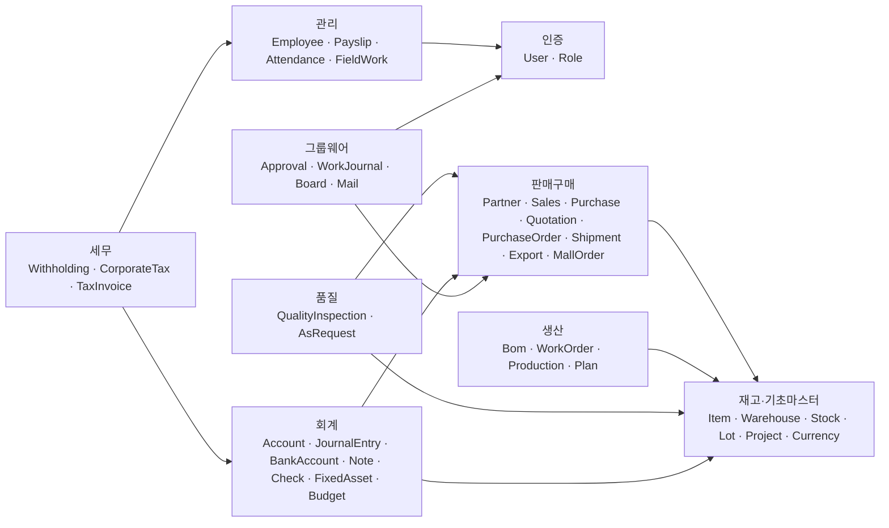

두 가지가 중심입니다.

- **Item·Warehouse**(재고 기초 마스터)를 거의 모든 모듈이 참조합니다.
- **JournalEntry**(회계전표)로 돈이 오가는 모든 업무가 모입니다. 판매·구매·지출·계좌·카드·어음·수표·
  고정자산·급여·간편전표·대체전표가 전부 분개 한 장으로 떨어집니다(§3.3).

`Project`는 원래 그룹웨어에 있었지만 판매·구매·비용 전표가 참조해야 해서 기초 마스터로 옮겼습니다
(`groupware → trade` 와 맞물려 순환이 생기던 문제). 자세한 규칙은 `CLAUDE.md` §4.

---

## 2. 엔티티 관계 (ERD)

### 2.1 영업 흐름 — 견적에서 수금까지

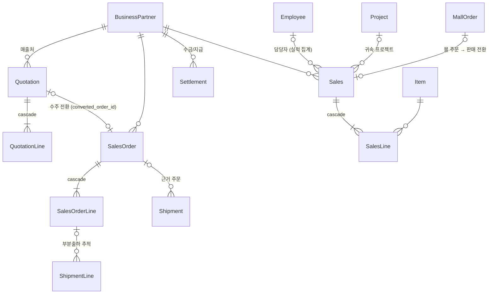

### 2.2 구매 흐름 — 발주에서 입고까지

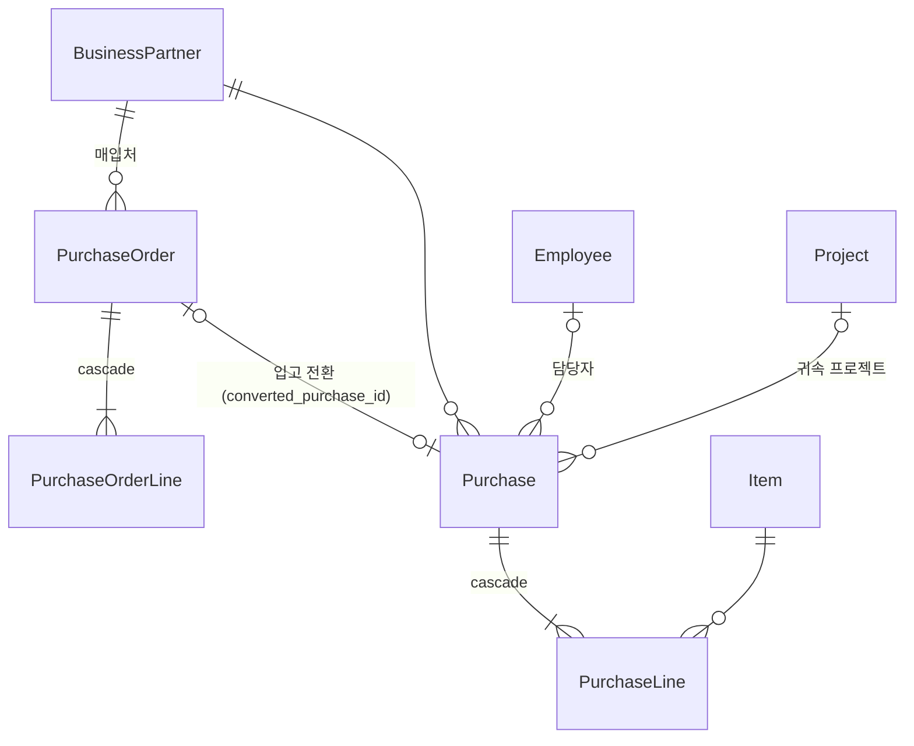

### 2.3 재고

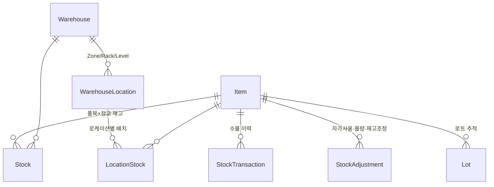

> **창고 재고 = 로케이션 배치분 + 미배치분.** WMS 로케이션에 얹어도 창고 총재고는 변하지 않습니다.
> 이 불변식은 `WmsService`가 강제합니다.

### 2.4 생산 · 품질

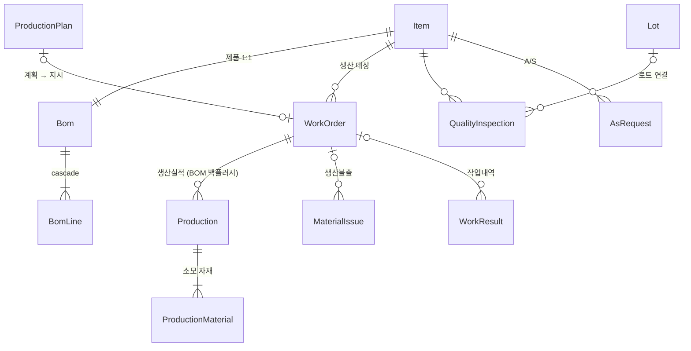

### 2.5 회계 — 모든 돈이 분개로 모인다

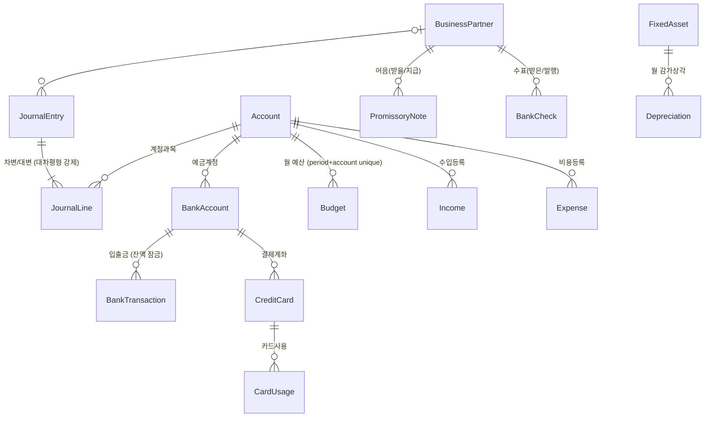

전표(Sales·Purchase·BankTransaction·CardUsage·PromissoryNote·BankCheck·Depreciation·Payslip·
Voucher·NonCash·AccountTransfer·CardPayment)는 각자 자기 규칙대로 움직이고, 회계로는
`JournalEntry.sourceType` 하나로 모입니다. 현재 출처는 15종입니다.

> `(source_type, source_id)`는 **유니크**합니다 — 업무전표 하나에 회계전표 하나.
> 어음처럼 한 전표에 이벤트가 여러 번(수취 → 할인료 → 부도) 붙는 경우, 대표 전표에만 `sourceId`를
> 걸고 나머지는 적요의 전표번호로 추적합니다.

### 2.6 관리(HR) · 세무 · 그룹웨어

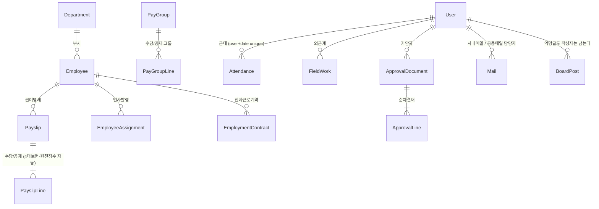

세무는 별도 마스터가 거의 없습니다. 원천징수는 **확정된 Payslip의 공제 라인을 집계**하고,
법인세는 회계전표에서 뽑은 손익에 세무조정을 얹습니다. 즉 세무 테이블은 신고서(스냅샷)만 저장합니다.

---

## 3. 업무 흐름 — 데이터가 실제로 흐르는 경로

### 3.1 영업: 견적 → 수주 → 출하 → 판매 → 수금

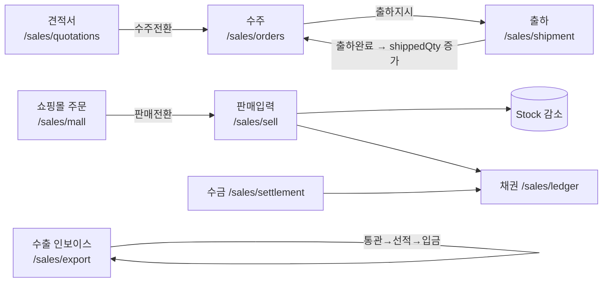

수량 규칙(출하):

| 시점 | `SalesOrderLine.shippedQty` | 주문 상태 |
|---|---|---|
| 출하지시 (READY) | 변화 없음. 단 **잔량을 선점**해 초과출하를 막음 | 접수 → 진행중 |
| 출하완료 (SHIPPED) | 출하수량만큼 증가 | 전량 도달 시 완료 |
| 출하취소 (CANCELED) | 되돌림 | 완료 → 진행중 |

**수주는 자동으로 판매전표가 되지 않습니다.** 수주는 출하로 이어지고, 판매전표는 따로 끊습니다.

### 3.2 구매·생산

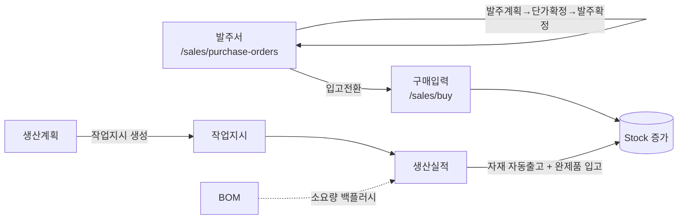

**재고를 바꾸는 곳은 다섯 갈래뿐입니다** — 입출고, 기타이동(자가사용·불량·재고조정), 생산실적,
판매/구매 전표, WMS 적치/피킹. 변경은 전부 `StockService` 를 지납니다(음수 재고 방지·행 잠금이 거기
있습니다). 조회만 하는 곳(예: MRP 소요량 계산)은 `StockRepository` 를 직접 읽습니다.

### 3.3 회계: 업무전표 → 분개

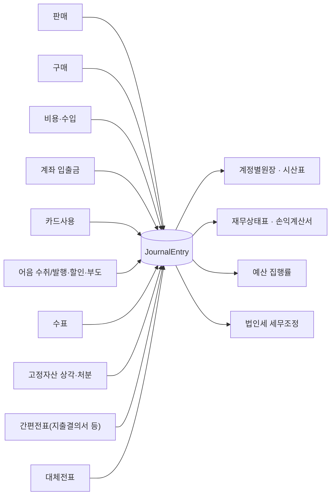

돈이 계좌에서 움직이는 처리(어음 결제·할인, 수표 입금·발행, 수입 계좌입금, 급여이체)는 **직접 예금을
건드리지 않고 `BankCardService` 를 거칩니다** — 일반 입출금은 `createTxn()`, 다른 전표에서 파생된
입출금은 `recordExternal()`. 잔액 잠금(`findForUpdate`)과 잔액부족 검증이 거기 한 곳에만 있어야
두 곳에서 계산해 갈라지지 않습니다.

### 3.4 급여 → 원천징수

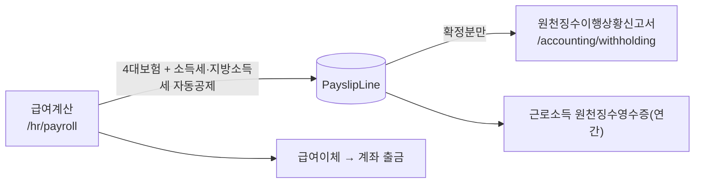

원천징수 집계는 세액을 **다시 계산하지 않습니다.** 급여명세의 공제 라인을 다시 묶기만 하므로,
세액을 손으로 조정해도 신고액과 실제 공제액이 어긋나지 않습니다.

### 3.5 계획 대비 실적 (저장하지 않고 볼 때 계산한다)

| 화면 | 계획(저장) | 실적(집계 원천) |
|---|---|---|
| 예산관리 | `budgets` | 회계전표(그 달·그 계정) |
| 자금계획 | `cash_plans` | 계좌 입출금(그 달) |
| 프로젝트별 손익 | — | 판매·구매·비용의 `project_id` |
| 담당자별 실적 | — | 판매·구매의 `employee_id` |

실적을 복제해 저장하면 전표를 고치는 순간 어긋나고, 그 어긋남은 아무도 눈치채지 못합니다.
그래서 전부 볼 때 계산합니다.

---

## 4. 화면에서 저장하면 어디로 가는가

프론트에는 별도 API 서비스 계층이 없습니다. 모든 페이지가 `src/api/client.ts`의 axios 인스턴스 `api`를
직접 씁니다. 401이면 인터셉터가 `/login`으로 보냅니다. 에러 메시지는 `extractErrorMessage()`로 통일합니다.

**지배적인 저장 패턴** — 거의 모든 CRUD 화면이 같습니다:

```ts
try { await api.post('/xxx', body); load() }   // 서버 저장 → 목록 재조회(REFETCH)
catch (err) { setError(extractErrorMessage(err)) }
```

| 저장 후 동작 | 해당 화면 |
|---|---|
| **NAVIGATE** | 로그인 → `/`, 기안서 작성 → `/groupware/approval/my` |
| **REFETCH** | 나머지 모든 저장 화면 |
| **외부 연동 없음(명시)** | 쇼핑몰(외부몰 API), 전자계약(공인인증기관), 공용메일(SMTP/IMAP), 다운로드 |

### 목록화면 공통 동작

`EcListShell`이 본문에 렌더된 표를 직접 읽어 **Excel(.xlsx)·인쇄·검색·Option·도움말**을 자동 배선합니다.
페이지는 `actions={[{ label: 'Excel' }]}`처럼 라벨만 넘기면 됩니다. 화면 필터가 그대로 내보내집니다.

인쇄는 `printTable()` 한 곳을 지나므로, **인쇄용 결재라인**(Self-Customizing → 인쇄서식)에서 기본
결재란을 지정하면 모든 목록 출력물 우측 상단에 담당/검토/승인 칸이 함께 찍힙니다.

---

## 5. 아직 문자열로만 이어진 관계 (남은 부채)

| 위치 | 현재 | 영향 |
|---|---|---|
| ~~전 모듈 `createdBy`~~ | **해소(V95)** | 45개 테이블의 `created_by` 가 `users(username)` 에 FK 로 묶였다. 없는 사용자명은 못 들어가고, 개명은 `ON UPDATE CASCADE` 로 전파되며, 작성 이력이 있는 계정은 지울 수 없다(`ON DELETE RESTRICT`). 컬럼은 여전히 문자열이라 API·화면은 그대로다 |
| `VacationRequest.status` | `"대기"/"승인"/"반려"` 문자열 | enum이어야 함. 오타 방어 없음 (다른 모듈은 전부 enum + CHECK) |
| `Expense.partnerName`, `WorkJournal.partnerName` | 자유 텍스트 | 다른 모듈은 `BusinessPartner` FK |
| `BoardPost.author`, `QualityInspection.inspector`, `WorkResult.worker` 등 | `String` | createdBy 와 달리 아직 FK 가 없다. 같은 방식(자연키 FK)으로 묶을 수 있다 |
| `LotStatus` enum | 선언만 되고 미사용 | `Lot` 은 `boolean held` 로 상태를 표현 중 |

**의도적으로 문자열을 남긴 곳**: `WorkResult.process`, `QualityInspection.lotNo` — 자유입력을 허용해야
해서 마스터에 일치하는 값이 있을 때만 FK를 채우고, 없으면 `null` + 입력 문자열을 보존합니다.

**전표 담당자는 문자열이 아닙니다.** `createdBy`(입력한 계정)와 별개로 `employee_id`(실적이 붙는 사람)를
FK로 겁니다 — 사무직원이 영업사원 대신 전표를 넣어도 실적은 영업사원에게 갑니다.

---

## 6. 스키마 변경 시 반드시 지킬 것

**스키마는 Flyway 마이그레이션(`backend/src/main/resources/db/migration/V*.sql`)으로만 바꿉니다.**
`ddl-auto: validate` 이므로 **엔티티만 고치면 기동이 실패합니다.** 이건 의도된 안전장치입니다.

1. `V<다음번호>__설명.sql` 을 추가한다. 이미 적용된 파일(특히 `V1__baseline_schema.sql`)은 **절대 수정하지 않는다** — 체크섬이 어긋나 기동이 실패한다.
2. **FK 컬럼에는 인덱스를 직접 만든다.** PostgreSQL은 FK를 만들어도 참조하는 쪽에 인덱스를 자동 생성하지 않는다.
3. 기존 행이 있는 테이블에 `NOT NULL` 컬럼을 넣을 때는 nullable 추가 → 백필 → 제약 부여, 세 단계로 나눈다.
4. 백엔드 재기동 → Flyway 적용 → `validate` 가 엔티티와 스키마 일치를 확인.
5. `node qa/qa.mjs` 로 회귀 확인 (단언 350+).

### 왜 이렇게 바뀌었나 (과거 사고)

예전에는 `ddl-auto: update` 였는데, **기존 행이 있는 테이블에는 기본값 없는 `NOT NULL` 컬럼이 추가되지
않습니다.** Postgres가 거부하고 Hibernate는 WARN 한 줄만 남기고 기동을 계속합니다. 컬럼은 안 생기고,
그 엔티티를 읽는 모든 API가 런타임에 500을 냅니다. 실제로 `SalesOrderLine.shippedQty` 가 이 함정에 빠져
`/api/sales-orders` 가 계속 500이었고, 화면에는 그냥 빈 목록으로 보였습니다.

### DB 초기화

```bash
docker compose down -v && docker compose up -d   # ⚠️ 데이터 전부 삭제
cd backend && ./mvnw spring-boot:run             # Flyway가 전체 마이그레이션 실행 + 기본 시드
node qa/qa.mjs                                   # 검증
```

`down -v` 전에 필요하면 백업: `docker exec erp-postgres pg_dump -U erp erp > backup.sql`
